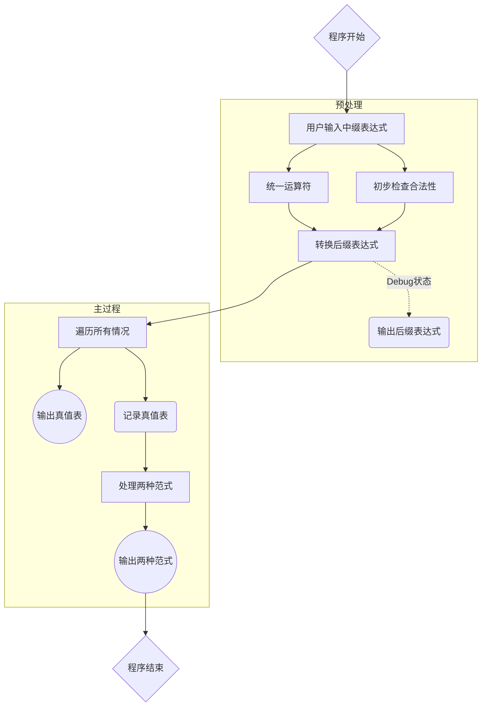
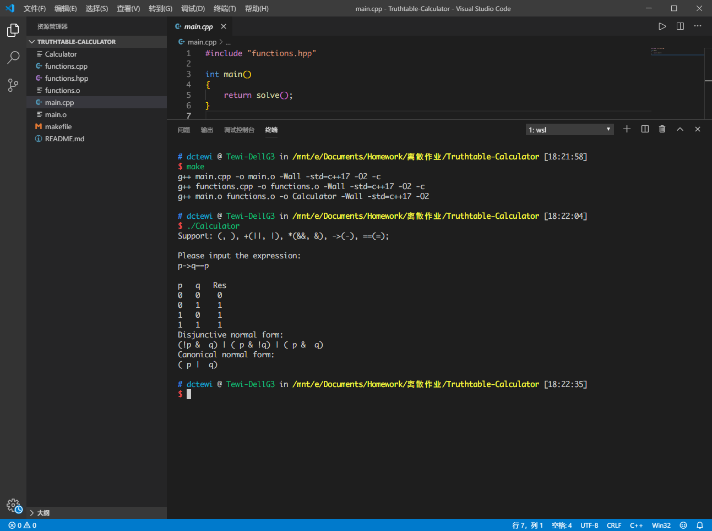
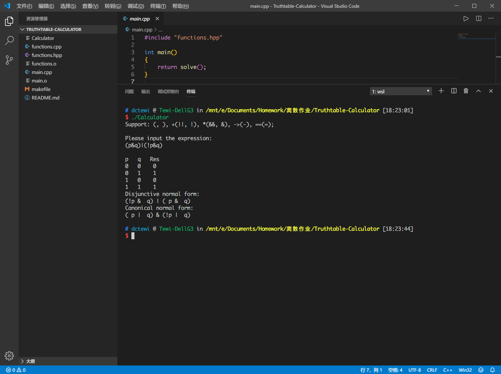
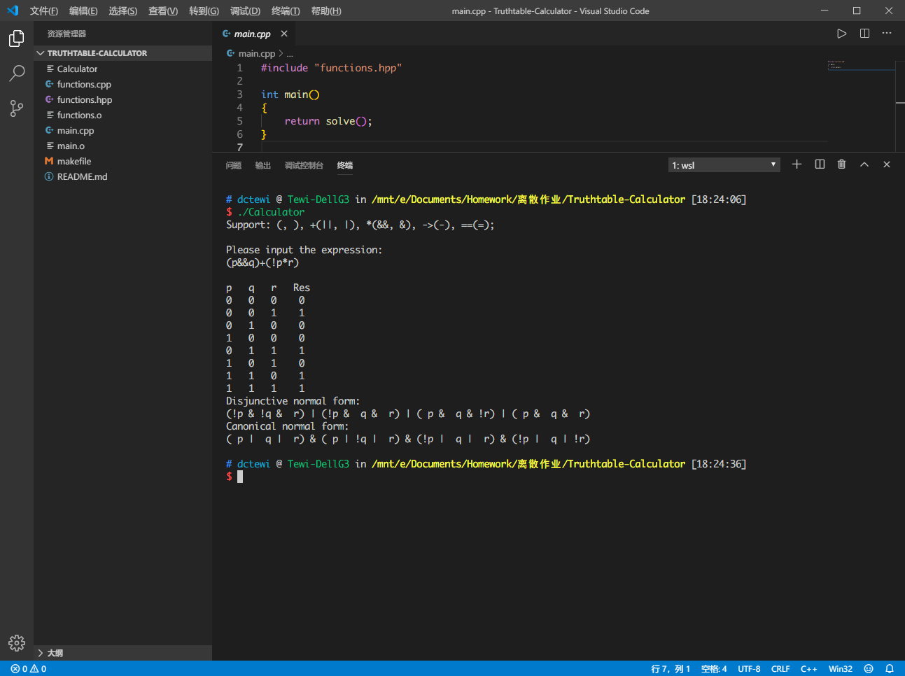
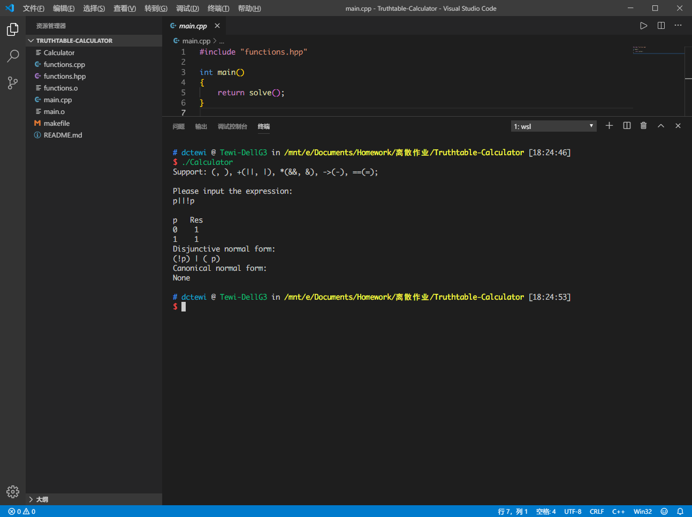

>姓名：冻葱Tewi
>
>学号：略
>
>邮箱：dctewi@stu.zzu.edu.cn dctewi@dctewi.com

# 真值表/范式计算器

​	离散数学课程设计作业。一个用来计算某命题真值表、主析取范式和主合取范式的计算器。

**使用语言：**

​	C++ (C++17标准)

**测试环境：**

- g++ (Ubuntu 7.4.0-1ubuntu1~18.04.1) 7.4.0
- g++ (MinGW.org GCC-6.3.0-1) 6.3.0

**编译部署：**

```shell
make
./Calculator
```

```shell
make
.\Calculator.exe
```

## 设计思想

​	求解主析取范式和主合取范式的重要前提就是正确计算出命题的真值表。

​	对于中缀表达式，虽然符合人类的表达习惯，但是对于计算机来说却不容易解析和计算。所以我先统一表达式中的运算符表达方式，接着把中缀表达式转换成计算机容易解析计算的后缀表达式后再进行后续处理。

​	对于输入的表达式，先进行一些简单的语法判断。对于有明显错误的表达式，直接抛出异常并结束运行。计算过程中如果得到了预料之外的状况，则说明表达式有潜在的逻辑错误，所以也抛出异常并结束运行。

​	对于转换后的后缀表达式，只需要从左向右依次扫描：数字则入栈等待运算操作，运算符则取出指定数目的待运算数字进行运算并继续入栈。最终即可得到运算结果。

​	对于真值表，运用 $STL$ 中的 `next_permutation()` 来从小到大遍历所有可能的排列并计算当前取值时运算的结果。显示当前行的同时进行判断：如果结果是 0，则当前排列进入主合取范式的队列内，反之进入主析取范式的队列内。

​	对于主析取范式和主合取范式，把每一种选项的取值排列存储下来，最后进行统一按格式输出即可。注意判断不存在主合取范式/主析取范式的情况（即`std::vector<int>`的大小是 0 的情况）。

## 流程图



## 输入输出截图








